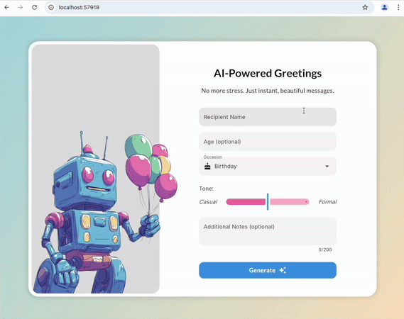

# AI-Powered Greeting Card Generator

A Flutter web app that generates personalized greeting cards using GenKit and Firebase Functions.



## Features

- Generate personalized greeting text based on recipient, occasion, and tone
- Create matching AI-generated images for greeting cards
- Responsive design for mobile and desktop
- Save generated cards as images

## Technology Stack

- Flutter for the frontend
- Firebase Functions for the backend
- Genkit for AI

## Getting Started

This repository has two branches:
- **master**: The completed application
- **starter**: The starting point for following the tutorial

### Setup Instructions

#### Using the starter branch

```bash
# Clone the repository
git clone https://github.com/yourusername/ai-greeting-card-generator.git
cd ai-greeting-card-generator

# Switch to the starter branch
git checkout starter

# Install dependencies
flutter pub get

# Configure Firebase
flutterfire configure

# Initialize Firebase Functions
firebase init functions
# Select TypeScript when prompted

# Install Genkit packages
cd functions && npm install @genkit-ai/dotprompt
cd functions && npm install @genkit-ai/vertexai

# Deploy Firebase Functions
firebase deploy --only functions
```

Then follow the tutorial to complete the implementation.

#### Using the master branch

```bash
# Clone the repository 
git clone https://github.com/yourusername/ai-greeting-card-generator.git
cd ai-greeting-card-generator

# Install dependencies
flutter pub get

# Configure Firebase with your project
flutterfire configure

# Deploy Firebase Functions
firebase deploy --only functions

# Run the app
flutter run -d chrome
```

## Known Issues

- Image generation can take a long time even with the "fast" Imagen model
- Some prompts may be flagged as unsafe by Imagen, even seemingly innocent ones

## Contributing

This is a template project and is not actively maintained. Feel free to fork and extend it for your own purposes. If you find issues, please report them in the repository issues.